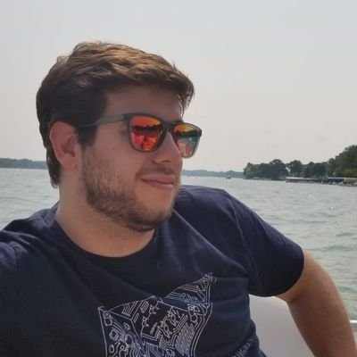

If you are here reading this, first of all let me say thank you! You have decided to spend part of your time reading my random thoughts, and I really appreciate. However, I'll ask you something in return: do not believe everything you see! Try things for yourself! And please, please, be happy! And do everything you can to make others happy! ❤️

## Who am I?

My name is Jorge Coca, and I was born in Madrid, Spain, in 1988. My family says that I was a very obedient and happy kid, always interested in reading books, and asking questions all the time. I guess that curiosity is what made me study engineering: I am interested in knowing how things work, how they connect with the world, and what can we do, as humans, to make things "better".

When I was 15 I learned how to play guitar with the only help of my computer and an internet connection. That was my first introduction to the "community": a group of people, spreaded all around the world, willing to help each other, even if they know they will never meet in person, just because they simply want a better world. That is a very powerful idea that, since then, drives many of the decisions that I have made in my life.

PS. One of the coolest things I have ever done in my life was to be in a band. We played in many concerts and different parts of Spain... and we had a lot of fun!

In 2011, after graduating engineering school in Madrid, I moved to Chicago to obtain my master's degree. Since 2012, I have been working as a software engineer, at many different companies, and many different roles. Since 2016, I have been working at BMW, mostly focused on mobile projects.

One way to contribute back to the community has been to participate in many different meetups and conferences. I am also the main organizer of the [Chicago Flutter Meetup](https://www.meetup.com/Flutter-Chicago/), where once a month many Flutter enthusiats get together to keep learning all together. This exposure to the community has also allowed me to be a book author, "Dart 2 In Action", that will be published hopefully during 2019 🤞

If you want to know more about me, ask me a question, or just connect, you can follow me on Twitter and connect: [@jcocaramos](https://twitter.com/jcocaramos)

